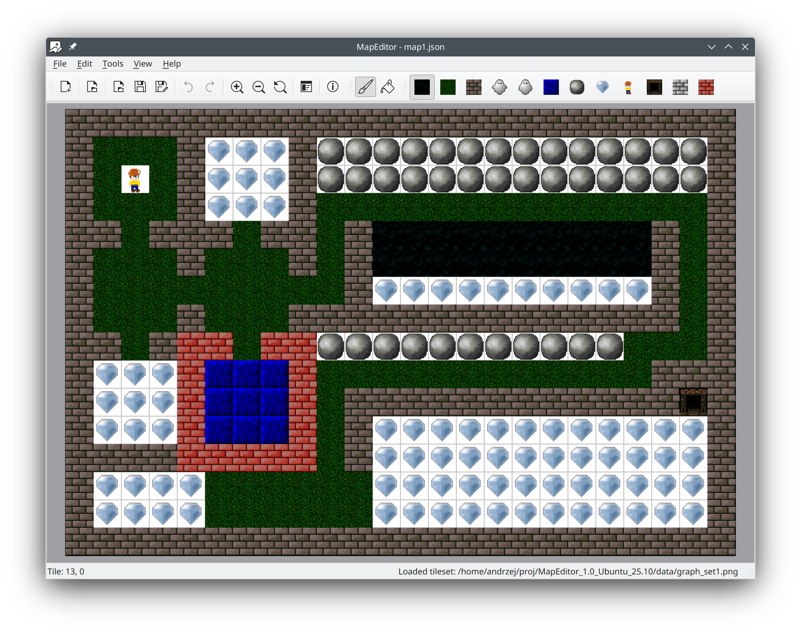

# MapEditor

A tile-based map editor built with Qt6 and modern C++17. Create, edit, and save 2D tile maps with an intuitive graphical interface.

## Overview

MapEditor is a lightweight map editor designed for 2D game development. It uses a tile-based approach where maps are composed of tiles from a tileset image. Maps are stored in human-readable JSON format for easy integration with game engines.



## Building the Project

### Requirements
- CMake 3.16 or later
- Qt6 (Widgets component)
- C++17 compatible compiler

### Linux Build

```bash
cmake -S . -B build -DCMAKE_BUILD_TYPE=Release
cmake --build build -j2
./build/MapEditor
```

### Windows Build

```bash
cmake -S . -B build -DCMAKE_BUILD_TYPE=Release
cmake --build build
build\Release\MapEditor.exe
```

## Key Concepts

### Tileset
A tileset is a PNG image containing multiple tiles arranged in a grid pattern:
- Tiles are arranged left-to-right, top-to-bottom
- Each tile must be exactly `tile_size` × `tile_size` pixels (default: 32×32)
- Image width must be a multiple of `tile_size`
- Tiles are indexed starting from 1 (index 0 = empty/no tile)
- Example: A 128×64 tileset with 32px tiles contains 8 tiles (4 columns × 2 rows)

### Map
A map is a 2D grid of tile indices:
- Defined by width and height (in tiles)
- Each cell contains a tile index (0 for empty, 1+ for tileset tiles)
- Stored as a flat array in row-major order
- Saved in JSON format for portability

## Features

### Editing
- **Create new maps** with customizable dimensions (1-1024 tiles, default 32×32)
- **Load and save maps** in JSON format with indented formatting
- **Undo/Redo** support for all tile operations (Ctrl+Z/Ctrl+Y)
- **Open tileset images** (PNG, JPG, BMP) with configurable tile size and count
- **Tileset settings dialog** to configure tile size (16-128px) and tile count (1-128)
- **Resize maps** via Map Preferences dialog (preserves existing tiles)
- **Dynamic tile palette** showing exact number of tiles from tileset
- **Paint tool** for single tile painting with left-click
- **Fill tool** for flood-filling adjacent tiles
- **Right-click erasing** to remove tiles (set to 0)
- **Click-and-drag** painting for continuous tile placement
- **Crosshair cursor** in valid drawing area
- **Real-time tile position** display in status bar (only within map bounds)
- **Unsaved changes detection** with save prompts

### View Controls
- **Zoom In/Out** via menu, toolbar, or Ctrl+Plus/Minus
- **Ctrl+Mouse Wheel** for smooth zooming
- **Reset View** to 1:1 zoom (Ctrl+0)
- **Middle-mouse button panning** for canvas navigation
- Zoom range: 0.25× to 4.0× (step: 1.25×)
- **Scrollable canvas** for editing large maps

### User Interface
- **Menu bar** with File, Edit, Tools, View, and Help menus
- **Main toolbar** with quick access to all file and view actions
- **Tools toolbar** with paint and fill tools
- **Detachable tile palette toolbar** dynamically sized to tile count
- **Status bar** with tile position and file status
- **Visual tile selection** with checkable palette buttons
- **Grid rendering** with tile boundaries and map border
- **Keyboard shortcuts** for common operations (F1-F6, F9)
- **Custom tool icons** from embedded resources
- **Toolbar visibility toggles** in View menu
- **Modification indicator** (*) in window title

### Tileset Support
- **Configurable tile size** (16-128px, default 32px)
- **Configurable tile count** (1-128 tiles, default 16)
- **Visual tile palette** extracted from tileset image
- **Fallback color palette** when no tileset is loaded (12 colors)
- **Automatic tile extraction** based on configured tile size
- **Tile scaling** to display size for consistent UI
- **Real-time tileset rendering** on map canvas

## Map Format (JSON)

```json
{
  "width": 32,
  "height": 32,
  "tiles": [0, 1, 2, 3, ...]
}
```

**Fields:**
- `width` - Map width in tiles
- `height` - Map height in tiles
- `tiles` - Flat array of tile indices (length = width × height)

## Keyboard Shortcuts

| Action | Shortcut |
|--------|----------|
| New Map | F1 |
| Open Tileset | F2 |
| Open Map | F3 |
| Save Map | F5 |
| Save Map As | F6 |
| Map Preferences | F9 |
| Undo | Ctrl+Z |
| Redo | Ctrl+Y |
| Paint Tool | P |
| Fill Tool | F |
| Select Tile 1-10 | 1-9, 0 |
| Next Tile | ] |
| Previous Tile | [ |
| Zoom In | Ctrl++ |
| Zoom Out | Ctrl+- |
| Reset View | Ctrl+0 |
| Exit | Ctrl+Q |

## Project Structure

```
MapEditor/
├── src/                    # Source code
│   ├── main.cpp           # Application entry point
│   ├── CMainWindow.*      # Main window
│   ├── CMainView.*        # Graphics view
│   ├── CMap.*             # Map data model
│   ├── CMapPreferencesDialog.*  # Map resize dialog
│   ├── CTilesetSettingsDialog.* # Tileset configuration dialog
│   └── Constants.h        # Project constants
├── resources/             # Embedded resources
│   ├── resources.qrc      # Qt resource file
│   ├── icon.png           # Application icon
│   ├── paint.png          # Paint tool icon
│   └── fill.png           # Fill tool icon
├── data/                  # Sample data (not embedded)
│   ├── graph_set*.png     # Example tilesets
│   └── map*.json          # Example maps
├── CMakeLists.txt         # Build configuration
└── README.md              # This file
```

## Source Files

### `src/main.cpp`
Application entry point. Creates QApplication instance, sets the application icon from embedded resources, and shows the main window.

### `src/Constants.h`
Centralized constants for the entire project:
- **Map dimensions**: Min/max/default width and height (1-1024, default 32×32)
- **Tile settings**: Default tile size (32px), palette tile count (12)
- **Window settings**: Default window size (800×600)
- **View settings**: Grid step (20px), scene size (4000×3000), zoom parameters (0.25-4.0×, step 1.25)
- **Tool constants**: TOOL_PAINT (0), TOOL_FILL (1)

### `src/CMainWindow.h` / `src/CMainWindow.cpp`
Main application window (QMainWindow subclass).

**Responsibilities:**
- Creates menu bar (File, Edit, Tools, View, Help)
- Creates main toolbar with file and view actions
- Creates tools toolbar with paint and fill tools
- Creates detachable tile palette toolbar dynamically sized to tile count
- Manages undo/redo stack for all tile operations
- Manages map file path and modification state
- Handles file operations (new, open, save) with unsaved changes prompts
- Manages tileset loading with configuration dialog
- Tracks selected tile and current tool for painting
- Contains status bar with position and file status labels
- Handles window close events with unsaved changes prompt

**Key Methods:**
- `onNewMap()` - Creates new map with default dimensions (32×32)
- `onOpenMap()` - Loads map from JSON file with validation
- `onSaveMap()` / `onSaveMapAs()` - Saves map to JSON with indented formatting
- `onOpenTileset()` - Shows tileset settings dialog and loads tileset
- `onMapPreferences()` - Opens map resize dialog
- `onPaintTool()` / `onFillTool()` - Switches between drawing tools
- `onTileSelected()` - Handles tile palette button clicks
- `onMouseTileChanged()` - Updates position label in status bar
- `createPalette()` - Creates tile palette toolbar with dynamic button count
- `updatePalette()` - Extracts and scales tiles from tileset or uses color fallback
- `updateWindowTitle()` - Updates title with filename and modification state
- `closeEvent()` - Prompts to save unsaved changes

### `src/CMainView.h` / `src/CMainView.cpp`
Custom QGraphicsView for rendering and interacting with the map.

**Responsibilities:**
- Manages QGraphicsScene with grid and map rendering
- Implements zoom functionality (in/out/reset)
- Handles middle-mouse button panning
- Processes Ctrl+wheel zoom events
- Implements paint tool for single tile painting
- Implements fill tool with flood fill algorithm
- Supports left-click painting and right-click erasing
- Supports click-and-drag painting
- Shows crosshair cursor in valid drawing area
- Emits tile position changes for status bar (only within bounds)
- Emits map modification signals

**Key Methods:**
- `setMap()` - Sets map and creates grid/map items
- `setTileset()` - Updates tileset for map rendering
- `setTileSize()` - Sets tile size for tileset extraction
- `setSelectedTile()` - Sets currently selected tile for painting
- `setTool()` - Switches between paint and fill tools
- `zoomIn()` / `zoomOut()` - Adjust zoom level by ZOOM_STEP (1.25×)
- `resetZoom()` - Reset to 1:1 zoom
- `applyZoom()` - Apply current zoom transform
- `paintTile()` - Paints tile or flood fills based on current tool
- `collectFillTiles()` - Collects tiles for flood fill operation (iterative algorithm)
- `mousePressEvent()` - Handles middle-button panning and left/right-click painting
- `mouseMoveEvent()` - Handles panning, drag painting, position updates, and cursor changes
- `mouseReleaseEvent()` - Ends panning or painting mode
- `wheelEvent()` - Handle Ctrl+wheel zoom

**Internal Classes:**
- `GridItem` - QGraphicsItem that renders white background, tile grid, and border
- `MapItem` - QGraphicsItem that renders map tiles from tileset or color palette

### `src/CMap.h` / `src/CMap.cpp`
Map data model (non-Qt class).

**Responsibilities:**
- Stores map dimensions (width, height)
- Stores tile data as flat std::vector<uint32_t>
- Provides tile access and modification with bounds checking
- Handles map resizing with optional fill value (preserves existing tiles)
- Clears map with fill value
- Serializes/deserializes to/from JSON

**Key Methods:**
- `tileAt(x, y)` - Get tile index at position (returns 0 if out of bounds)
- `setTile(x, y, value)` - Set tile index at position (ignores if out of bounds)
- `resize(w, h, fill)` - Resize map with fill value, copying existing tiles that fit
- `clear(fill)` - Fill entire map with specified tile value
- `toJson()` - Export map to QJsonObject with width, height, and tiles array
- `fromJson()` - Import map from QJsonObject with validation

### `src/CMapPreferencesDialog.h` / `src/CMapPreferencesDialog.cpp`
Dialog for changing map dimensions (QDialog subclass).

**Responsibilities:**
- Displays spin boxes for width and height with current values
- Validates input ranges (1-1024)
- Returns new dimensions on acceptance

**Key Methods:**
- Constructor takes current width and height to pre-populate fields
- `width()` / `height()` - Get selected dimensions

### `src/CTilesetSettingsDialog.h` / `src/CTilesetSettingsDialog.cpp`
Dialog for configuring tileset parameters (QDialog subclass).

**Responsibilities:**
- Displays tileset preview (scaled to max 256×256)
- Provides spin box for tile size (16-128px, default 32px)
- Provides spin box for tile count (1-128, default 16)
- Returns configuration on acceptance

**Key Methods:**
- Constructor takes tileset image for preview
- `tileSize()` - Get selected tile size
- `tileCount()` - Get selected tile count

## Development Notes

### Qt Meta-Object Compiler (MOC)
- The project uses `AUTOMOC ON` in CMakeLists.txt
- All classes with `Q_OBJECT` macro are automatically processed
- Do not remove AUTOMOC if headers use Q_OBJECT

### Qt Resource System
- The project uses `AUTORCC ON` to compile Qt resource files (.qrc)
- Resources are embedded into the executable at build time
- Application icon is loaded from `:/icon.png` (embedded resource)
- To add new resources, edit `resources/resources.qrc` and rebuild

### Adding New Source Files
1. Create .h and .cpp files in `src/` directory
2. Add .cpp file to `add_executable()` in CMakeLists.txt
3. Rebuild project

### Adding New Resources
1. Place resource files (images, icons, etc.) in `resources/` directory
2. Add entries to `resources/resources.qrc`
3. Access in code using `:/path/to/file` syntax
4. Rebuild project to embed resources

### Code Style
- Forward declarations in headers for pointer/reference types
- Include corresponding header first in .cpp files
- Use Qt parent-child ownership for automatic cleanup
- Prefer const references for parameters

### Platform-Specific Configs
- `.vscode/` - Current VS Code settings
- `.vscode_lin/` - Linux-specific launch/task configs
- `.vscode_win/` - Windows-specific launch/task configs

## License

This project is licensed under the GNU General Public License v3.0.
See LICENSE.md for details.

## Author

Andrzej Pływaczyk, 2026
Email: andrzej.plywaczyk@gmail.com
